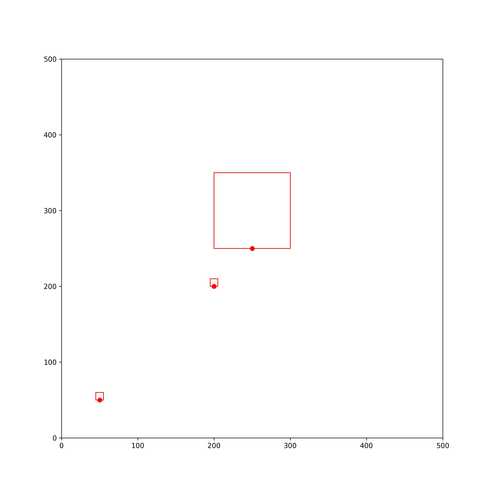

# label_placement
[](https://colab.research.google.com/drive/1zC2en-O0_bwiRDE3dUBvLsKJpNktlE-A?usp=sharing
)

```
Usage: main.py [OPTIONS]

Options:
  --input_labels_file PATH  Path to file describing labels
  --xlim FLOAT              Canvas x-axis boundary
  --ylim FLOAT              Canvas y-axis boundary
  --help                    Show this message and exit.
 ```

## Result example:

